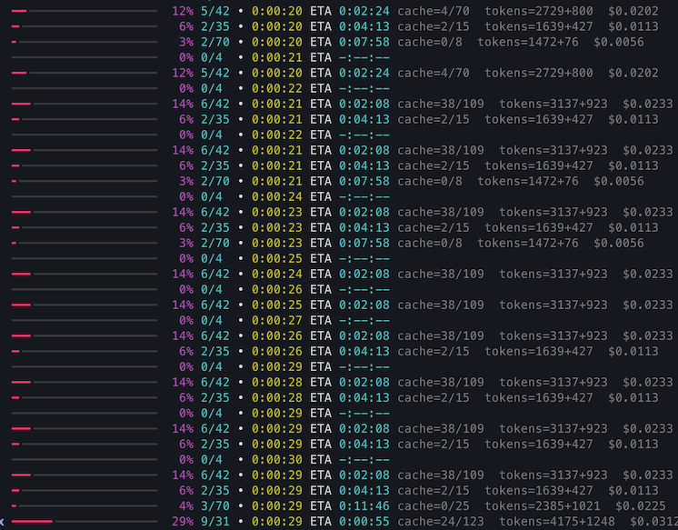

# PowerPoint Translator using Amazon Bedrock

A powerful PowerPoint translation tool that leverages Amazon Bedrock models for high-quality translation. This service can be used both as a standalone command-line tool and as a FastMCP (Fast Model Context Protocol) service for integration with AI assistants like Kiro. It translates PowerPoint presentations while preserving formatting and structure.

<a href="https://glama.ai/mcp/servers/@daekeun-ml/ppt-translator">
  
</a>

## Features

### New features

- **Source Language Auto-Detect**: One-shot LLM detection from the document text; prompt, cache key, and cost estimate all use the detected language. Skips the API entirely if source == target.
- **Chart Translation**: Translates chart titles, axis labels, category names, and series names — without touching numeric data
- **Translation Cache**: Pluggable SQLite / in-memory cache that reuses prior translations across runs; cache key includes model, language, polishing, and glossary
- **Custom Glossary**: External YAML glossary for consistent terminology per language; auto-detected from `./glossary.yaml`
- **Dry-Run / Cost Preview**: `--dry-run` estimates tokens and cost before actually calling Bedrock
- **Automatic Retry**: tenacity-backed exponential backoff on throttling / transient Bedrock errors
- **Rich Progress**: Real-time progress bar with ETA, cache hit rate, and running token/cost totals — per-file slide progress rows in batch mode

### Existing features

- **PowerPoint Translation**: Translate text content in PowerPoint presentations
- **Amazon Bedrock Integration**: Uses Amazon Bedrock models for high-quality translation (Claude Opus 4.7, Sonnet 4.6, Nova, Llama 4, and more)
- **Format Preservation**: Maintains original formatting, layouts, and styles
- **Language-Specific Fonts**: Automatically applies appropriate fonts for target languages
- **Color & Style Preservation**: Preserves original text colors and formatting even for untranslated content
- **Standalone & MCP Support**: Use as a command-line tool or integrate with AI assistants via FastMCP
- **Multiple Languages**: Supports translation between various languages (90+ supported)
- **Batch Processing**: Can handle multiple slides, text elements, and entire folders efficiently (parallel workers)
- **Selective Translation**: Translate entire presentations, specific slides, or all files in a folder

## Examples

### Translation

The PowerPoint Translator maintains the original formatting while accurately translating content:

<table>
<tr>
<td></td>
<td></td>
</tr>
<tr>
<td align="center"><em>Original presentation slide in English <br> with complex layout</em></td>
<td align="center"><em>Same presentation translated to Korean <br> with preserved formatting and layout</em></td>
</tr>
</table>

### Claude Code MCP Examples

<table>
<tr>
<td></td>
<td></td>
</tr>
<tr>
<td align="center"><em>Check MCP</em></td>
<td align="center"><em>MCP example</em></td>
</tr>
</table>

### Usage Examples

> 🧾 **Quick reference**: see [docs/cheatsheet.md](docs/cheatsheet.md) for a compact list of everyday flags.

**Translate entire presentation:**
```bash
uv run ppt-translate translate samples/en.pptx --target-language ko
```


**Translate specific slides:**
```bash
uv run ppt-translate translate-slides samples/en.pptx --slides "1,3" --target-language ko
```

**Batch translate all PPT files in a folder:**
```bash
# Recursive by default — translates all .pptx in samples/ and its subfolders
uv run ppt-translate batch-translate samples/ --target-language ko

# Top level only (skip subfolders)
uv run ppt-translate batch-translate samples/ --target-language ko --no-recursive

# Specify output folder
uv run ppt-translate batch-translate samples/ -t ja -o output/

# Specify number of parallel workers (default: 4)
uv run ppt-translate batch-translate samples/ -t ko -w 4

# Custom output and workers
uv run ppt-translate batch-translate reInvent-2025/ -t ko -o translated/ -w 8
```



**Get slide information:**
```bash
uv run ppt-translate info samples/en.pptx
```

**Preview cost before translating (dry-run):**
```bash
# Estimate tokens / cost without calling Bedrock — no file is written
uv run ppt-translate translate samples/en.pptx -t ko --dry-run
```


**Translation cache (enabled by default):**
```bash
# SQLite cache at ~/.ppt-translator/cache.db — translations are reused across runs
uv run ppt-translate translate samples/en.pptx -t ko

# In-memory cache (per-process, no disk writes)
uv run ppt-translate translate samples/en.pptx -t ko --cache-backend memory

# Disable cache entirely
uv run ppt-translate translate samples/en.pptx -t ko --no-cache

# Custom cache path
uv run ppt-translate translate samples/en.pptx -t ko --cache-path /tmp/my-cache.db
```

The cache key is `sha256(source_text + target_language + model_id + polishing + glossary_hash)`,
so translations are automatically reused only when every relevant input matches.
Changing the glossary, language, or model invalidates entries as expected.

**Custom glossary (YAML):**
```bash
# Auto-detects ./glossary.yaml in the current directory
uv run ppt-translate translate samples/en.pptx -t ko

# Or point to a specific glossary file
uv run ppt-translate translate samples/en.pptx -t ko -g my-glossary.yaml
```

Example `glossary.yaml`:
```yaml
ko:
  "API": "API"            # src == tgt → keep as-is (do not translate)
  "Foundation Model": "파운데이션 모델"
  "Observability": "Observability"
ja:
  "Cloud": "クラウド"
```

**Skip chart translation (if you want charts untouched):**
```bash
uv run ppt-translate translate samples/en.pptx -t ko --no-charts
```

**Source language (auto-detected by default):**
```bash
# Source language is auto-detected on first run (1 extra Bedrock call per PPT)
uv run ppt-translate translate samples/en.pptx -t ko

# Or specify it explicitly to skip detection
uv run ppt-translate translate samples/en.pptx --source-language en -t ko

# Disable auto-detection entirely (let the model infer from context, like before)
uv run ppt-translate translate samples/en.pptx -t ko --no-detect-source
```

The detected language is folded into the cache key, so the same text under
different source languages won't cross-contaminate. If source == target
(e.g., translating a Korean deck to Korean) the tool skips Bedrock entirely.

## Prerequisites

- Python 3.11 or higher
- AWS Account with Bedrock access
- AWS CLI configured with appropriate credentials
- Access to Amazon Bedrock models (e.g., Claude, Nova, etc.)

### AWS Credentials Setup

Before using this service, ensure your AWS credentials are properly configured. You have several options:

1. **AWS CLI Configuration (Recommended)**:
   ```bash
   aws configure
   ```
   This will prompt you for:
   - AWS Access Key ID
   - AWS Secret Access Key
   - Default region name
   - Default output format

2. **AWS Profile Configuration**:
   ```bash
   aws configure --profile your-profile-name
   ```

3. **Environment Variables** (if needed):
   ```bash
   export AWS_ACCESS_KEY_ID=your_access_key
   export AWS_SECRET_ACCESS_KEY=your_secret_key
   export AWS_DEFAULT_REGION=us-east-1
   ```

4. **IAM Roles** (when running on EC2 instances)

The service will automatically use your configured AWS credentials. You can specify which profile to use in the `.env` file.

## Installation

1. **Clone the repository**:
   ```bash
   git clone https://github.com/daekeun-ml/ppt-translator
   cd ppt-translator
   ```

2. **Install dependencies using uv (recommended)**:
   ```bash
   uv sync
   ```
   
   Or using pip:
   ```bash
   pip install -r requirements.txt
   ```

3. **Set up environment variables**:
   Edit `.env` file with your configuration:
   ```bash
   # AWS Configuration
   AWS_REGION=us-east-1
   AWS_PROFILE=default
   
   # Translation Configuration
   DEFAULT_TARGET_LANGUAGE=ko
   BEDROCK_MODEL_ID=global.anthropic.claude-sonnet-4-6
   
   # Translation Settings
   MAX_TOKENS=4000
   TEMPERATURE=0.1
   ENABLE_POLISHING=true
   BATCH_SIZE=20
   CONTEXT_THRESHOLD=5
   
   # Font Settings by Language
   FONT_KOREAN=맑은 고딕
   FONT_JAPANESE=Yu Gothic UI
   FONT_ENGLISH=Amazon Ember
   FONT_CHINESE=Microsoft YaHei
   FONT_DEFAULT=Arial
   
   # Debug Settings
   DEBUG=false

   # Post-processing Settings
   ENABLE_TEXT_AUTOFIT=true
   TEXT_LENGTH_THRESHOLD=10
   ```

   **Note**: AWS credentials (Access Key ID and Secret Access Key) are not needed in the `.env` file if you have already configured them using `aws configure`. The service will automatically use your AWS CLI credentials.

## Usage

### Standalone Command-Line Usage

The PowerPoint Translator can be used directly from the command line using the `ppt-translate` command:

```bash
# Translate entire presentation to Korean
uv run ppt-translate translate samples/en.pptx --target-language ko

# Translate specific slides (individual slides)
uv run ppt-translate translate-slides samples/en.pptx --slides "1,3" --target-language ko

# Translate slide range
uv run ppt-translate translate-slides samples/en.pptx --slides "2-4" --target-language ko

# Translate mixed (individual + range)
uv run ppt-translate translate-slides samples/en.pptx --slides "1,2-4" --target-language ko

# Get slide information and previews
uv run ppt-translate info samples/en.pptx

# Show help
uv run ppt-translate --help
uv run ppt-translate translate --help
uv run ppt-translate translate-slides --help
```

### FastMCP Server Mode (for AI Assistant Integration)

Start the FastMCP server for integration with AI assistants like Kiro:

```bash
# Using uv (recommended)
uv run mcp_server.py

# Using python directly
python mcp_server.py
```

## FastMCP Setup

The same server works with any MCP host (Claude Code, Kiro, Kiro CLI, ...). Pick your host below — the JSON schema is identical; only the config file path differs.

### Shared server config

Replace `/path/to/ppt-translator/` with the actual path to your clone. `AWS_*` env vars are optional when `aws configure` is already set up.

```json
{
  "mcpServers": {
    "ppt-translator": {
      "command": "uv",
      "args": [
        "--project", "/path/to/ppt-translator",
        "run", "/path/to/ppt-translator/mcp_server.py"
      ],
      "env": {
        "AWS_REGION": "us-east-1",
        "AWS_PROFILE": "default",
        "BEDROCK_MODEL_ID": "global.anthropic.claude-sonnet-4-6"
      },
      "disabled": false,
      "autoApprove": [
        "translate_powerpoint",
        "get_slide_info",
        "get_slide_preview",
        "translate_specific_slides"
      ]
    }
  }
}
```

> Prefer running with plain `python` instead of `uv`? Swap `"command": "uv"` and remove `"--project", ...` from `args`, leaving `"args": ["/path/to/ppt-translator/mcp_server.py"]`.

### Claude Code

[Claude Code](https://claude.com/claude-code) is Anthropic's official CLI. Two ways to register:

**Option 1 — `claude mcp add` (fastest)**

```bash
# Project-scoped (only when running Claude Code inside this repo)
claude mcp add ppt-translator \
  --scope project \
  -- uv --project /path/to/ppt-translator run /path/to/ppt-translator/mcp_server.py


claude mcp add ppt-translator \
  --scope project \
  -- uv --project /Users/daekeun/Github/ppt-translator run /Users/daekeun/Github/ppt-translator/mcp_server.py

# User-scoped (available in every project)
claude mcp add ppt-translator \
  --scope user \
  -e AWS_REGION=us-east-1 \
  -e AWS_PROFILE=default \
  -e BEDROCK_MODEL_ID=global.anthropic.claude-sonnet-4-6 \
  -- uv --project /path/to/ppt-translator run /path/to/ppt-translator/mcp_server.py
```

Restart Claude Code, then run `/mcp` to confirm the server is connected.

**Option 2 — config file**

Paste the [shared JSON](#shared-server-config) into one of:

- Project-scoped: `.mcp.json` at the repo root (commit to share with the team)
- User-scoped: `~/.claude.json` under the top-level `mcpServers` key

**Troubleshooting**

- `claude --debug` prints MCP connection logs at startup.
- Test the server standalone: `uv run mcp_server.py`. If that errors, fix it before retrying the integration.

### Kiro

- Install Kiro: <https://kiro.dev> (CLI: <https://kiro.dev/cli>)
- Paste the [shared JSON](#shared-server-config) into the appropriate file:
  - **Kiro (desktop)**: `~/.kiro/settings/mcp.json`
  - **Kiro CLI (macOS/Linux)**: `~/.aws/amazonq/mcp.json`
  - **Kiro CLI (Windows)**: `%APPDATA%\amazonq\mcp.json`

### Using it

Just ask in natural language — the host picks the right tool automatically:

```
Translate samples/en.pptx to Korean
Batch-translate samples/ into Japanese, dry-run first
Show me what's in slide 3 of en.pptx
```

## Available MCP Tools

The MCP server provides the following tools:

- **`translate_powerpoint`**: Translate an entire PowerPoint presentation
  - Parameters:
    - `input_file`: Path to the input PowerPoint file (.pptx)
    - `target_language`: Target language code (default: 'ko')
    - `output_file`: Path for the translated output file (optional, auto-generated)
    - `model_id`: Amazon Bedrock model ID (default from `BEDROCK_MODEL_ID` env)
    - `enable_polishing`: Enable natural language polishing (default: true)
    - `glossary_file`: Path to a glossary YAML file (defaults to `./glossary.yaml` if present)
    - `cache_backend`: `"sqlite"` (default), `"memory"`, or `"none"`
    - `dry_run`: If true, estimate cost without translating (default: false)
    - `translate_charts`: Translate chart titles/axes/categories/series (default: true)
    - `source_language`: ISO 639-1 source code. Auto-detected if omitted.
    - `auto_detect_source`: Run 1-shot LLM language detection when `source_language` is omitted (default: true)

- **`translate_specific_slides`**: Translate only specific slides in a PowerPoint presentation
  - Parameters:
    - `input_file`: Path to the input PowerPoint file (.pptx)
    - `slide_numbers`: Comma-separated slide numbers to translate (e.g., "1,3,5" or "2-4,7")
    - `target_language`: Target language code (default: 'ko')
    - `output_file`: Path for the translated output file (optional, auto-generated)
    - `model_id`: Amazon Bedrock model ID (default from `BEDROCK_MODEL_ID` env)
    - `enable_polishing`: Enable natural language polishing (default: true)
    - `glossary_file`, `cache_backend`, `dry_run`, `translate_charts`, `source_language`, `auto_detect_source`: same as above

- **`batch_translate_powerpoint`**: Translate all PowerPoint files in a folder in parallel
  - Parameters:
    - `input_folder`, `target_language`, `output_folder`, `model_id`, `enable_polishing`
    - `recursive`, `workers` (default: 4)
    - `glossary_file`, `cache_backend`, `cache_path`, `dry_run`, `translate_charts`, `source_language`, `auto_detect_source`

- **`get_slide_info`**: Get information about slides in a PowerPoint presentation
  - Parameters:
    - `input_file`: Path to the PowerPoint file (.pptx)
  - Returns: Overview with slide count and preview of each slide's content

- **`get_slide_preview`**: Get detailed preview of a specific slide's content
  - Parameters:
    - `input_file`: Path to the PowerPoint file (.pptx)
    - `slide_number`: Slide number to preview (1-based indexing)

- **`list_supported_languages`**: List all supported target languages for translation

- **`list_supported_models`**: List all supported Amazon Bedrock models

- **`get_translation_help`**: Get help information about using the translator

## Configuration

### Environment Variables

- `AWS_REGION`: AWS region for Bedrock service (default: us-east-1)
- `AWS_PROFILE`: AWS profile to use (default: default)
- `DEFAULT_TARGET_LANGUAGE`: Default target language for translation (default: ko)
- `BEDROCK_MODEL_ID`: Bedrock model ID for translation (default: global.anthropic.claude-sonnet-4-6)
- `BEDROCK_MAX_RETRIES`: Max retry attempts for transient Bedrock errors (default: 5)
- `MAX_TOKENS`: Maximum tokens for translation requests (default: 4000)
- `TEMPERATURE`: Temperature setting for AI model (default: 0.1)
- `ENABLE_POLISHING`: Enable translation polishing (default: true)
- `BATCH_SIZE`: Number of texts to process in a batch (default: 20)
- `CONTEXT_THRESHOLD`: Number of texts to trigger context-aware translation (default: 5)
- `CACHE_BACKEND`: Translation cache backend — `sqlite` / `memory` / `none` (default: sqlite)
- `CACHE_PATH`: SQLite cache file location (default: `~/.ppt-translator/cache.db`)
- `DEBUG`: Enable debug logging (default: false)

### Supported Claude Models (Bedrock)

The latest Anthropic models on Amazon Bedrock are registered in `Config.SUPPORTED_MODELS`
and `pricing.py`. Common IDs you can pass via `--model-id` or `BEDROCK_MODEL_ID`:

| Model | Global profile | US profile |
|---|---|---|
| Claude Opus 4.7 | `global.anthropic.claude-opus-4-7` | `us.anthropic.claude-opus-4-7` |
| Claude Opus 4.6 | `global.anthropic.claude-opus-4-6-v1` | `us.anthropic.claude-opus-4-6-v1` |
| Claude Sonnet 4.6 | `global.anthropic.claude-sonnet-4-6` | `us.anthropic.claude-sonnet-4-6` |
| Claude Opus 4.5 | `global.anthropic.claude-opus-4-5-20251101-v1:0` | `us.anthropic.claude-opus-4-5-20251101-v1:0` |
| Claude Sonnet 4.5 | `global.anthropic.claude-sonnet-4-5-20250929-v1:0` | `us.anthropic.claude-sonnet-4-5-20250929-v1:0` |
| Claude Haiku 4.5 | `global.anthropic.claude-haiku-4-5-20251001-v1:0` | `us.anthropic.claude-haiku-4-5-20251001-v1:0` |
| Claude 3.7 Sonnet | — | `us.anthropic.claude-3-7-sonnet-20250219-v1:0` |

Claude Opus 4.6 / 4.7 also support `eu.`, `au.` (Opus 4.6), and `jp.` (Opus 4.7)
geo-specific inference profiles. Availability depends on your AWS account /
region — check the AWS Bedrock console to confirm.

### Supported Languages

The service supports translation between major languages including:
- English (en)
- Korean (ko)
- Japanese (ja)
- Chinese Simplified (zh)
- Chinese Traditional (zh-tw)
- Spanish (es)
- French (fr)
- German (de)
- Italian (it)
- Portuguese (pt)
- Russian (ru)
- Arabic (ar)
- Hindi (hi)
- And many more...

## Troubleshooting

### Common Issues

1. **AWS Credentials Not Found**:
   - Ensure AWS credentials are properly configured
   - Check AWS CLI configuration: `aws configure list`

2. **Bedrock Access Denied**:
   - Verify your AWS account has access to Bedrock
   - Check if the specified model is available in your region

3. **FastMCP Connection Issues**:
   - Verify the path in mcp.json is correct
   - Check that Python and dependencies are properly installed
   - Review logs in Q Developer for error messages
   - Test the server: `uv run python mcp_server.py`

4. **PowerPoint File Issues**:
   - Ensure the input file is a valid PowerPoint (.pptx) file
   - Check file permissions for both input and output paths

5. **Module Import Errors**:
   - Use `uv run` to ensure proper virtual environment activation
   - Install dependencies: `uv sync`

## Development

### Project Structure

```
ppt-translator/
├── mcp_server.py                    # FastMCP server implementation
├── main.py                          # Main entry point
├── ppt_translator/                  # Core package
│   ├── __init__.py                  # Package initialization
│   ├── cli.py                       # Command-line interface
│   ├── ppt_handler.py               # PowerPoint processing logic
│   ├── translation_engine.py        # Translation service (cache/glossary/metrics)
│   ├── bedrock_client.py            # Amazon Bedrock client (with retry)
│   ├── retry.py                     # tenacity-based retry policy for Bedrock
│   ├── cache.py                     # Translation cache backends (SQLite/Memory/Null)
│   ├── glossary.py                  # YAML glossary loader and hashing
│   ├── pricing.py                   # Model pricing table + token/cost estimation
│   ├── chart_handler.py             # Chart text collection and update
│   ├── progress.py                  # Rich-based progress display
│   ├── language_detection.py        # 1-shot source language detection (LLM)
│   ├── post_processing.py           # Post-processing utilities
│   ├── config.py                    # Configuration management
│   ├── dependencies.py              # Dependency management
│   ├── text_utils.py                # Text processing utilities
│   └── prompts.py                   # Translation prompts
├── glossary.yaml                    # Default glossary (per-language term map)
├── requirements.txt                 # Python dependencies
├── pyproject.toml                   # Project configuration (uv)
├── uv.lock                          # Dependency lock file
├── .env                             # Environment variables template
├── Dockerfile                       # Docker configuration
├── docs/                            # Documentation
├── imgs/                            # Example images and screenshots
└── samples/                         # Sample files
```

## License

This project is licensed under the MIT License - see the LICENSE file for details.
