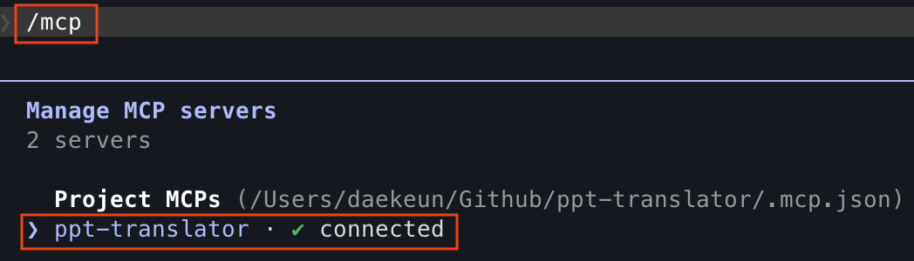
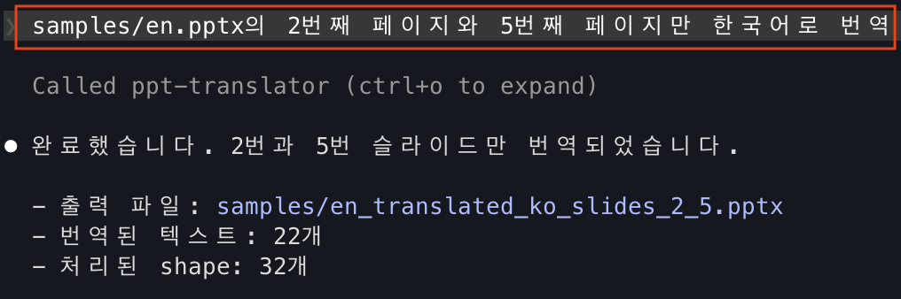
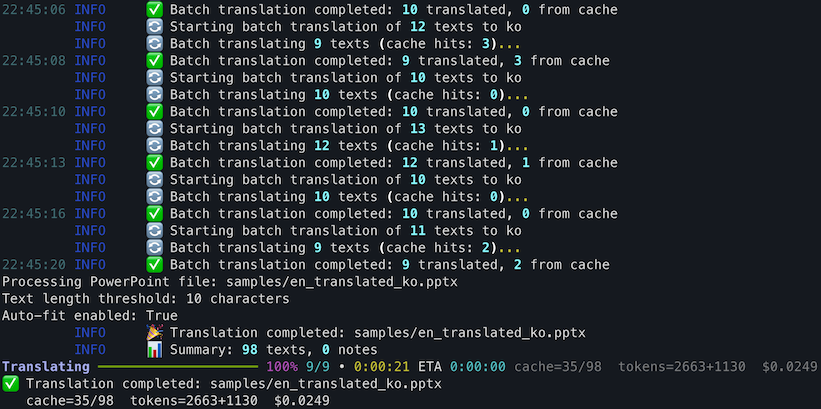
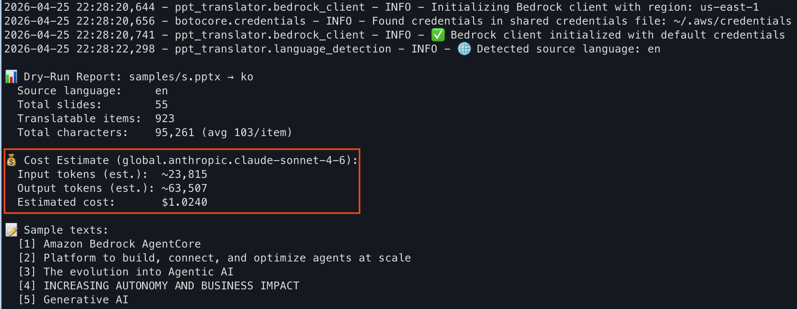

# Amazon Bedrock을 사용한 PowerPoint 번역기

Amazon Bedrock 모델을 활용하여 고품질 번역을 제공하는 강력한 PowerPoint 번역 도구입니다. 이 서비스는 독립 실행형 명령줄 도구로 사용하거나 Kiro와 같은 AI 어시스턴트와 통합하기 위한 FastMCP(Fast Model Context Protocol) 서비스로 사용할 수 있습니다. 서식과 구조를 유지하면서 PowerPoint 프레젠테이션을 번역합니다.

## 기능

### 신규 기능

- **원본 언어 자동 감지**: 문서 텍스트를 샘플링해 LLM 1회 호출로 source language 자동 감지. 프롬프트/캐시 키/비용 추정 모두 감지된 언어 기준으로 동작. 원본 == 대상이면 API 호출 자체를 건너뜀
- **차트 번역**: 차트 제목·축 레이블·카테고리·시리즈 이름을 번역 (수치 데이터는 건드리지 않음)
- **번역 캐시**: SQLite / 메모리 캐시 플러그인 — 이전 번역을 재사용해 API 비용/시간 절감. 캐시 키에 모델·언어·폴리싱·용어집 해시 포함
- **사용자 정의 용어집**: 언어별 용어 매핑을 YAML 파일로 외부화. `./glossary.yaml` 자동 탐색
- **Dry-Run / 비용 미리보기**: `--dry-run` 으로 실제 Bedrock 호출 전에 예상 토큰·비용 확인
- **자동 재시도**: tenacity 기반 exponential backoff — 스로틀링/일시적 오류에 자동 복구
- **진행률 표시 (rich)**: 실시간 진행바 + ETA + 캐시 히트율 + 누적 토큰/비용. 배치 모드에서는 파일별 슬라이드 진행바까지 함께 표시

### 기존 기능

- **PowerPoint 번역**: PowerPoint 프레젠테이션의 텍스트 내용 번역
- **Amazon Bedrock 통합**: 고품질 번역을 위한 Amazon Bedrock 모델 (Claude Opus 4.7, Sonnet 4.6, Nova, Llama 4 등) 사용
- **서식 보존**: 원본 서식, 레이아웃 및 스타일 유지
- **언어별 폰트**: 대상 언어에 적합한 폰트 자동 적용
- **색상 및 스타일 보존**: 번역되지 않은 내용도 원본 텍스트 색상과 서식 유지
- **독립 실행형 및 MCP 지원**: 명령줄 도구로 사용하거나 FastMCP를 통해 AI 어시스턴트와 통합
- **다국어 지원**: 90+ 언어 간 번역 지원
- **배치 처리**: 여러 슬라이드, 텍스트 요소 및 전체 폴더를 병렬 워커로 효율적으로 처리
- **선택적 번역**: 전체 프레젠테이션, 특정 슬라이드 또는 폴더 내 모든 파일 번역

## 예제

### 번역

PowerPoint 번역기는 원본 서식을 유지하면서 정확하게 내용을 번역합니다:

<table>
<tr>
<td></td>
<td></td>
</tr>
<tr>
<td align="center"><em>복잡한 레이아웃의 영어 원본 프레젠테이션 슬라이드</em></td>
<td align="center"><em>서식과 레이아웃이 보존된 한국어 번역본</em></td>
</tr>
</table>

### Claude Code MCP 예제

<table>
<tr>
<td></td>
<td></td>
</tr>
<tr>
<td align="center"><em>MCP 연결 체크</em></td>
<td align="center"><em>MCP 예시</em></td>
</tr>
</table>


### 사용 예제

> 🧾 **빠른 참조**: 자주 쓰는 옵션은 [docs/cheatsheet.md](docs/cheatsheet.md) 에 정리되어 있습니다.

**전체 프레젠테이션 번역:**
```bash
uv run ppt-translate translate samples/en.pptx --target-language ko
```



**특정 슬라이드 번역:**
```bash
uv run ppt-translate translate-slides samples/en.pptx --slides "1,3" --target-language ko
```

**폴더 내 모든 PPT 파일 일괄 번역:**
```bash
# 기본적으로 하위 폴더까지 재귀 처리 (병렬 처리)
uv run ppt-translate batch-translate samples/ --target-language ko

# 최상위 폴더만 (하위 폴더 제외)
uv run ppt-translate batch-translate samples/ --target-language ko --no-recursive

# 출력 폴더 지정
uv run ppt-translate batch-translate samples/ -t ja -o output/

# 병렬 워커 수 지정 (기본값: 4)
uv run ppt-translate batch-translate samples/ -t ko -w 4
```

**슬라이드 정보 확인:**
```bash
uv run ppt-translate info samples/en.pptx
```

**번역 전 비용 미리보기 (dry-run):**
```bash
# Bedrock 호출 없이 예상 토큰·비용만 계산 — 파일을 저장하지 않음
uv run ppt-translate translate samples/en.pptx -t ko --dry-run
```



**번역 캐시 (기본 활성화):**
```bash
# 기본값: SQLite 캐시 (~/.ppt-translator/cache.db) — 이전 번역을 자동 재사용
uv run ppt-translate translate samples/en.pptx -t ko

# 메모리 캐시 (프로세스 내, 디스크 쓰기 없음)
uv run ppt-translate translate samples/en.pptx -t ko --cache-backend memory

# 캐시 비활성화
uv run ppt-translate translate samples/en.pptx -t ko --no-cache

# 캐시 파일 경로 지정
uv run ppt-translate translate samples/en.pptx -t ko --cache-path /tmp/my-cache.db
```

캐시 키는 `sha256(원본텍스트 + 대상언어 + 모델ID + 폴리싱 여부 + 용어집 해시)` 이므로,
동일한 입력 조건일 때만 재사용됩니다. 용어집·언어·모델이 바뀌면 자동으로 캐시가 무효화됩니다.

**사용자 정의 용어집 (YAML):**
```bash
# 현재 디렉터리의 ./glossary.yaml 이 있으면 자동 사용
uv run ppt-translate translate samples/en.pptx -t ko

# 또는 특정 파일 지정
uv run ppt-translate translate samples/en.pptx -t ko -g my-glossary.yaml
```

`glossary.yaml` 예시:
```yaml
ko:
  "API": "API"            # 원문 == 번역문 → 그대로 유지 (번역 안 함)
  "Foundation Model": "파운데이션 모델"
  "Observability": "Observability"
ja:
  "Cloud": "クラウド"
```

**차트 번역 건너뛰기 (원본 그대로 두려면):**
```bash
uv run ppt-translate translate samples/en.pptx -t ko --no-charts
```

**원본 언어 (기본적으로 자동 감지):**
```bash
# 기본: 첫 실행 시 Bedrock에 1회 추가 호출로 원본 언어 자동 감지
uv run ppt-translate translate samples/en.pptx -t ko

# 명시 지정: 감지 호출 생략
uv run ppt-translate translate samples/en.pptx --source-language en -t ko

# 자동 감지 비활성화 (예전처럼 모델이 문맥에서 추론하도록 둠)
uv run ppt-translate translate samples/en.pptx -t ko --no-detect-source
```

감지된 언어는 캐시 키에도 포함되어, 동일 텍스트가 다른 원본 언어에서 왔을 때 서로 섞이지 않습니다.
원본 == 대상이면 (예: 한국어 자료를 다시 한국어로 "번역") Bedrock 호출을 완전히 건너뜁니다.

## 사전 요구사항

- Python 3.11 이상
- Bedrock 액세스 권한이 있는 AWS 계정
- 적절한 자격 증명으로 구성된 AWS CLI
- Amazon Bedrock 모델 액세스 권한 (예: Claude, Nova 등)

### AWS 자격 증명 설정

이 서비스를 사용하기 전에 AWS 자격 증명이 올바르게 구성되어 있는지 확인하세요. 여러 옵션이 있습니다:

1. **AWS CLI 구성 (권장)**:
   ```bash
   aws configure
   ```
   다음 정보를 입력하라는 메시지가 표시됩니다:
   - AWS Access Key ID
   - AWS Secret Access Key
   - Default region name
   - Default output format

2. **AWS 프로필 구성**:
   ```bash
   aws configure --profile your-profile-name
   ```

3. **환경 변수** (필요한 경우):
   ```bash
   export AWS_ACCESS_KEY_ID=your_access_key
   export AWS_SECRET_ACCESS_KEY=your_secret_key
   export AWS_DEFAULT_REGION=us-east-1
   ```

4. **IAM 역할** (EC2 인스턴스에서 실행할 때)

서비스는 구성된 AWS 자격 증명을 자동으로 사용합니다. `.env` 파일에서 사용할 프로필을 지정할 수 있습니다.

## 설치

1. **저장소 복제**:
   ```bash
   git clone https://github.com/daekeun-ml/ppt-translator
   cd ppt-translator
   ```

2. **uv를 사용한 의존성 설치 (권장)**:
   ```bash
   uv sync
   ```
   
   또는 pip 사용:
   ```bash
   pip install -r requirements.txt
   ```

3. **환경 변수 설정**:
   ```bash
   cp .env.example .env
   ```
   
   구성에 맞게 `.env` 파일 편집:
   ```bash
   # AWS 구성
   AWS_REGION=us-east-1
   AWS_PROFILE=default
   
   # 번역 구성
   DEFAULT_TARGET_LANGUAGE=ko
   BEDROCK_MODEL_ID=global.anthropic.claude-sonnet-4-6
   
   # 번역 설정
   MAX_TOKENS=4000
   TEMPERATURE=0.1
   ENABLE_POLISHING=true
   BATCH_SIZE=20
   CONTEXT_THRESHOLD=5
   
   # 언어별 폰트 설정
   FONT_KOREAN=맑은 고딕
   FONT_JAPANESE=Yu Gothic UI
   FONT_ENGLISH=Amazon Ember
   FONT_CHINESE=Microsoft YaHei
   FONT_DEFAULT=Arial
   
   # 디버그 설정
   DEBUG=false

   # 후처리 설정
   ENABLE_TEXT_AUTOFIT=true
   TEXT_LENGTH_THRESHOLD=10
   ```

   **참고**: `aws configure`를 사용하여 이미 구성한 경우 `.env` 파일에 AWS 자격 증명(Access Key ID 및 Secret Access Key)이 필요하지 않습니다. 서비스는 AWS CLI 자격 증명을 자동으로 사용합니다.

## 사용법

### 독립 실행형 명령줄 사용

PowerPoint 번역기는 `ppt-translate` 명령을 사용하여 명령줄에서 직접 사용할 수 있습니다:

```bash
# 전체 프레젠테이션을 한국어로 번역
uv run ppt-translate translate samples/en.pptx --target-language ko

# 특정 슬라이드 번역 (개별 슬라이드)
uv run ppt-translate translate-slides samples/en.pptx --slides "1,3" --target-language ko

# 슬라이드 범위 번역
uv run ppt-translate translate-slides samples/en.pptx --slides "2-4" --target-language ko

# 혼합 번역 (개별 + 범위)
uv run ppt-translate translate-slides samples/en.pptx --slides "1,2-4" --target-language ko

# 폴더 내 모든 PPT 파일 일괄 번역 (병렬 처리)
uv run ppt-translate batch-translate samples/ --target-language ko

# 출력 폴더 지정하여 일괄 번역
uv run ppt-translate batch-translate samples/ -t ja -o output/

# 병렬 워커 수 지정 (기본값: 4)
uv run ppt-translate batch-translate samples/ -t ko -w 4

# 슬라이드 정보 및 미리보기 확인
uv run ppt-translate info samples/en.pptx

# 도움말 표시
uv run ppt-translate --help
uv run ppt-translate translate --help
uv run ppt-translate translate-slides --help
```

### FastMCP 서버 모드 (AI 어시스턴트 통합용)

AI 어시스턴트(예: Kiro)와 통합하기 위한 FastMCP 서버 시작:

```bash
# uv 사용 (권장)
uv run mcp_server.py

# python 직접 사용
python mcp_server.py
```

## FastMCP 설정

동일한 서버가 모든 MCP 호스트(Claude Code, Kiro, Kiro CLI ...)에서 그대로 동작합니다. JSON 스키마는 공통이고, 호스트마다 설정 파일 위치만 다릅니다.

### 공통 서버 설정

`/path/to/ppt-translator/` 는 실제 저장소 경로로 바꾸세요. `aws configure` 가 이미 되어 있다면 `AWS_*` 환경변수는 생략 가능합니다.

```json
{
  "mcpServers": {
    "ppt-translator": {
      "command": "uv",
      "args": [
        "--project", "/path/to/ppt-translator",
        "run", "/path/to/ppt-translator/mcp_server.py"
      ],
      "env": {
        "AWS_REGION": "us-east-1",
        "AWS_PROFILE": "default",
        "BEDROCK_MODEL_ID": "global.anthropic.claude-sonnet-4-6"
      },
      "disabled": false,
      "autoApprove": [
        "translate_powerpoint",
        "get_slide_info",
        "get_slide_preview",
        "translate_specific_slides"
      ]
    }
  }
}
```

> `uv` 대신 일반 `python` 으로 돌리려면 `"command": "python"` 으로 바꾸고 `args` 에서 `"--project", ...` 를 제거해 `"args": ["/path/to/ppt-translator/mcp_server.py"]` 로 두세요.

### Claude Code

[Claude Code](https://claude.com/claude-code) 는 Anthropic 공식 CLI입니다. 등록 방법 두 가지:

**방법 1 — `claude mcp add` (가장 빠름)**

```bash
# 프로젝트 범위 (이 저장소에서 Claude Code 실행할 때만)
claude mcp add ppt-translator \
  --scope project \
  -- uv --project /path/to/ppt-translator run /path/to/ppt-translator/mcp_server.py

# 사용자 범위 (모든 프로젝트에서 사용 가능)
claude mcp add ppt-translator \
  --scope user \
  -e AWS_REGION=us-east-1 \
  -e AWS_PROFILE=default \
  -e BEDROCK_MODEL_ID=global.anthropic.claude-sonnet-4-6 \
  -- uv --project /path/to/ppt-translator run /path/to/ppt-translator/mcp_server.py
```

Claude Code 재시작 후 `/mcp` 명령으로 서버 연결 상태 확인.

**방법 2 — 설정 파일**

위의 [공통 JSON](#공통-서버-설정) 을 아래 중 하나에 붙여넣기:

- 프로젝트 범위: 저장소 루트에 `.mcp.json` (git 커밋하면 팀원과 공유 가능)
- 사용자 범위: `~/.claude.json` 의 최상위 `mcpServers` 키

**문제 해결**

- `claude --debug` 로 실행하면 MCP 연결 로그가 터미널에 출력됩니다.
- 서버 단독 테스트: `uv run mcp_server.py`. 여기서 에러가 나면 통합 전에 먼저 해결.

### Kiro

- Kiro 설치: <https://kiro.dev> (CLI: <https://kiro.dev/cli>)
- [공통 JSON](#공통-서버-설정) 을 아래 파일에 붙여넣기:
  - **Kiro (데스크톱)**: `~/.kiro/settings/mcp.json`
  - **Kiro CLI (macOS/Linux)**: `~/.aws/amazonq/mcp.json`
  - **Kiro CLI (Windows)**: `%APPDATA%\amazonq\mcp.json`

### 사용 방법

자연어로 요청하면 호스트가 적절한 도구를 자동으로 선택합니다:

```
samples/en.pptx 를 한국어로 번역해줘
samples/ 폴더 안의 모든 pptx를 일본어로 번역. dry-run 먼저.
en.pptx 슬라이드 3에 뭐가 있는지 보여줘
```

## 사용 가능한 MCP 도구

MCP 서버는 다음 도구를 제공합니다:

- **`translate_powerpoint`**: 전체 PowerPoint 프레젠테이션 번역
  - 매개변수:
    - `input_file`: 입력 PowerPoint 파일 경로 (.pptx)
    - `target_language`: 대상 언어 코드 (기본값: 'ko')
    - `output_file`: 번역된 출력 파일 경로 (선택사항, 자동 생성)
    - `model_id`: Amazon Bedrock 모델 ID (기본값: `BEDROCK_MODEL_ID` 환경변수)
    - `enable_polishing`: 자연어 다듬기 활성화 (기본값: true)
    - `glossary_file`: 용어집 YAML 파일 경로 (미지정 시 `./glossary.yaml` 자동 탐색)
    - `cache_backend`: `"sqlite"` (기본), `"memory"`, 또는 `"none"`
    - `dry_run`: true면 실제 번역 없이 비용 추정만 반환 (기본: false)
    - `translate_charts`: 차트 제목/축/카테고리/시리즈 번역 여부 (기본: true)
    - `source_language`: ISO 639-1 원본 언어 코드. 미지정 시 자동 감지.
    - `auto_detect_source`: `source_language` 미지정 시 LLM 1회 호출로 감지 (기본: true)

- **`translate_specific_slides`**: PowerPoint 프레젠테이션의 특정 슬라이드만 번역
  - 매개변수:
    - `input_file`: 입력 PowerPoint 파일 경로 (.pptx)
    - `slide_numbers`: 번역할 슬라이드 번호 (쉼표로 구분, 예: "1,3,5" 또는 "2-4,7")
    - `target_language`: 대상 언어 코드 (기본값: 'ko')
    - `output_file`: 번역된 출력 파일 경로 (선택사항, 자동 생성)
    - `model_id`: Amazon Bedrock 모델 ID (기본값: `BEDROCK_MODEL_ID` 환경변수)
    - `enable_polishing`: 자연어 다듬기 활성화 (기본값: true)
    - `glossary_file`, `cache_backend`, `dry_run`, `translate_charts`, `source_language`, `auto_detect_source`: 위와 동일

- **`batch_translate_powerpoint`**: 폴더 내 모든 PowerPoint 파일을 병렬 번역
  - 매개변수:
    - `input_folder`, `target_language`, `output_folder`, `model_id`, `enable_polishing`
    - `recursive`, `workers` (기본: 4)
    - `glossary_file`, `cache_backend`, `cache_path`, `dry_run`, `translate_charts`, `source_language`, `auto_detect_source`

- **`get_slide_info`**: PowerPoint 프레젠테이션의 슬라이드 정보 확인
  - 매개변수:
    - `input_file`: PowerPoint 파일 경로 (.pptx)
  - 반환값: 슬라이드 수와 각 슬라이드 내용 미리보기가 포함된 개요

- **`get_slide_preview`**: 특정 슬라이드 내용의 상세 미리보기
  - 매개변수:
    - `input_file`: PowerPoint 파일 경로 (.pptx)
    - `slide_number`: 미리보기할 슬라이드 번호 (1부터 시작)

- **`list_supported_languages`**: 번역 지원 대상 언어 목록

- **`list_supported_models`**: 지원되는 모든 Amazon Bedrock 모델 목록

- **`get_translation_help`**: 번역기 사용에 대한 도움말 정보

## 구성

### 환경 변수

- `AWS_REGION`: Bedrock 서비스용 AWS 리전 (기본값: us-east-1)
- `AWS_PROFILE`: 사용할 AWS 프로필 (기본값: default)
- `DEFAULT_TARGET_LANGUAGE`: 번역 기본 대상 언어 (기본값: ko)
- `BEDROCK_MODEL_ID`: 번역용 Bedrock 모델 ID (기본값: global.anthropic.claude-sonnet-4-6)
- `BEDROCK_MAX_RETRIES`: Bedrock 일시적 오류 시 최대 재시도 횟수 (기본값: 5)
- `MAX_TOKENS`: 번역 요청 최대 토큰 수 (기본값: 4000)
- `TEMPERATURE`: AI 모델 온도 설정 (기본값: 0.1)
- `ENABLE_POLISHING`: 번역 다듬기 활성화 (기본값: true)
- `BATCH_SIZE`: 배치로 처리할 텍스트 수 (기본값: 20)
- `CONTEXT_THRESHOLD`: 컨텍스트 인식 번역을 트리거할 텍스트 수 (기본값: 5)
- `CACHE_BACKEND`: 번역 캐시 백엔드 — `sqlite` / `memory` / `none` (기본값: sqlite)
- `CACHE_PATH`: SQLite 캐시 파일 위치 (기본값: `~/.ppt-translator/cache.db`)
- `DEBUG`: 디버그 로깅 활성화 (기본값: false)

### 지원 Claude 모델 (Bedrock)

최신 Anthropic 모델은 `Config.SUPPORTED_MODELS` 와 `pricing.py` 에 등록되어 있습니다.
`--model-id` 플래그 또는 `BEDROCK_MODEL_ID` 환경변수로 지정 가능:

| 모델 | Global 프로파일 | US 프로파일 |
|---|---|---|
| Claude Opus 4.7 | `global.anthropic.claude-opus-4-7` | `us.anthropic.claude-opus-4-7` |
| Claude Opus 4.6 | `global.anthropic.claude-opus-4-6-v1` | `us.anthropic.claude-opus-4-6-v1` |
| Claude Sonnet 4.6 | `global.anthropic.claude-sonnet-4-6` | `us.anthropic.claude-sonnet-4-6` |
| Claude Opus 4.5 | `global.anthropic.claude-opus-4-5-20251101-v1:0` | `us.anthropic.claude-opus-4-5-20251101-v1:0` |
| Claude Sonnet 4.5 | `global.anthropic.claude-sonnet-4-5-20250929-v1:0` | `us.anthropic.claude-sonnet-4-5-20250929-v1:0` |
| Claude Haiku 4.5 | `global.anthropic.claude-haiku-4-5-20251001-v1:0` | `us.anthropic.claude-haiku-4-5-20251001-v1:0` |
| Claude 3.7 Sonnet | — | `us.anthropic.claude-3-7-sonnet-20250219-v1:0` |

Claude Opus 4.6/4.7 은 `eu.`, `au.` (Opus 4.6), `jp.` (Opus 4.7) 지역별 추론 프로파일도 지원합니다.
실제 가용성은 AWS 계정/리전에 따라 다르므로 Bedrock 콘솔에서 확인하세요.

### 지원 언어

이 서비스는 다음을 포함한 주요 언어 간 번역을 지원합니다:
- 영어 (en)
- 한국어 (ko)
- 일본어 (ja)
- 중국어 간체 (zh)
- 중국어 번체 (zh-tw)
- 스페인어 (es)
- 프랑스어 (fr)
- 독일어 (de)
- 이탈리아어 (it)
- 포르투갈어 (pt)
- 러시아어 (ru)
- 아랍어 (ar)
- 힌디어 (hi)
- 그 외 다수...

## 문제 해결

### 일반적인 문제

1. **AWS 자격 증명을 찾을 수 없음**:
   - AWS 자격 증명이 올바르게 구성되어 있는지 확인
   - AWS CLI 구성 확인: `aws configure list`

2. **Bedrock 액세스 거부**:
   - AWS 계정에 Bedrock 액세스 권한이 있는지 확인
   - 지정된 모델이 해당 리전에서 사용 가능한지 확인

3. **FastMCP 연결 문제**:
   - mcp.json의 경로가 올바른지 확인
   - Python과 의존성이 올바르게 설치되어 있는지 확인
   - Q Developer의 로그에서 오류 메시지 확인
   - 서버 테스트: `uv run python mcp_server.py`

4. **PowerPoint 파일 문제**:
   - 입력 파일이 유효한 PowerPoint (.pptx) 파일인지 확인
   - 입력 및 출력 경로의 파일 권한 확인

5. **모듈 가져오기 오류**:
   - 적절한 가상 환경 활성화를 위해 `uv run` 사용
   - 의존성 설치: `uv sync`

## 개발

### 프로젝트 구조

```
ppt-translator/
├── mcp_server.py                    # FastMCP 서버 구현
├── main.py                          # 메인 진입점
├── ppt_translator/                  # 핵심 패키지
│   ├── __init__.py                  # 패키지 초기화
│   ├── cli.py                       # 명령줄 인터페이스
│   ├── ppt_handler.py               # PowerPoint 처리 로직
│   ├── translation_engine.py        # 번역 엔진 (캐시·용어집·메트릭)
│   ├── bedrock_client.py            # Amazon Bedrock 클라이언트 (재시도 포함)
│   ├── retry.py                     # Bedrock 재시도 정책 (tenacity)
│   ├── cache.py                     # 번역 캐시 백엔드 (SQLite/Memory/Null)
│   ├── glossary.py                  # YAML 용어집 로더 및 해시
│   ├── pricing.py                   # 모델별 가격 + 토큰/비용 추정
│   ├── chart_handler.py             # 차트 텍스트 수집/적용
│   ├── progress.py                  # Rich 기반 진행률 표시
│   ├── language_detection.py        # 1-shot 원본 언어 감지 (LLM)
│   ├── post_processing.py           # 후처리 유틸리티
│   ├── config.py                    # 설정 관리
│   ├── dependencies.py              # 의존성 관리
│   ├── text_utils.py                # 텍스트 처리 유틸리티
│   └── prompts.py                   # 번역 프롬프트
├── glossary.yaml                    # 기본 용어집 (언어별 매핑)
├── requirements.txt                 # Python 의존성
├── pyproject.toml                   # 프로젝트 설정 (uv)
├── uv.lock                          # 의존성 잠금 파일
├── .env.example                     # 환경 변수 템플릿
├── Dockerfile                       # Docker 설정
├── docs/                            # 문서
├── imgs/                            # 예제 이미지 및 스크린샷
└── samples/                         # 샘플 파일
```

## 라이선스

이 프로젝트는 MIT 라이선스에 따라 라이선스가 부여됩니다. 자세한 내용은 LICENSE 파일을 참조하세요.
